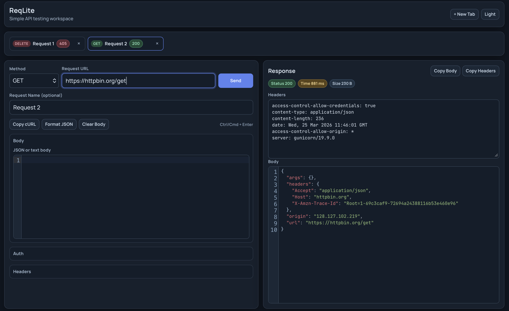

# ReqLite (Tauri)

Desktop mini-Postman built with Tauri + React + Rust.

## Persistent Context

For every new session (including Codex), start here:

1. `AGENTS.md`
2. `docs/PROJECT_CONTEXT.md`
3. `docs/HANDOFF.md`
4. `docs/DECISIONS.md`

These files are the persistent memory of project state, decisions, and next steps.

## Local Development

```bash
pnpm install
pnpm tauri dev
```

## Release to GitHub

Workflow is configured in `.github/workflows/release.yml`.

1. Push project to a GitHub repository.
2. Create and push a version tag:

```bash
git tag v0.1.1
git push origin v0.1.1
```

3. Open GitHub:
- `Actions` tab: wait for `Release Tauri App` workflow to finish.
- `Releases` tab: download generated installers for macOS, Windows, Linux.

If a release job fails, you can run it again manually:

1. Open `Actions` -> `Release Tauri App`.
2. Click `Run workflow`.
3. Set `tag_name` (for example `v0.1.1`).

